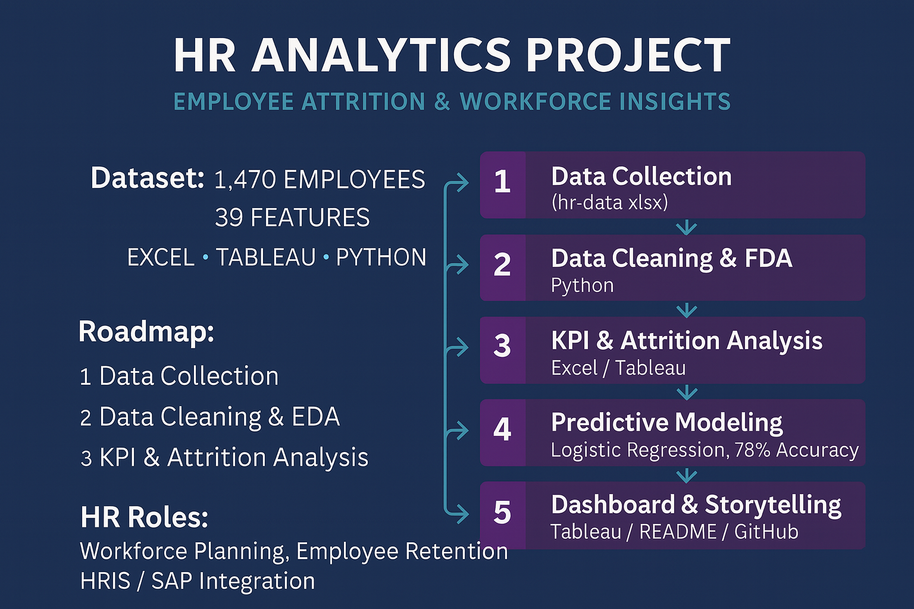
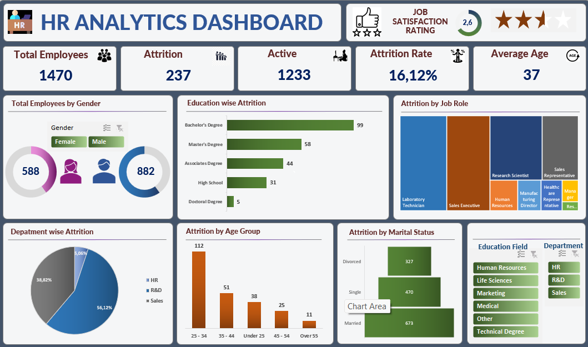

#  HR Analytics Project (Employee Attrition & Workforce Insights)

##  Project Roadmap

This roadmap summarizes how the HR Analytics project was carried out:




This project applies **HR Analytics** to study workforce trends, employee engagement, and attrition risk.  
It uses a real HR dataset (**1,470 employees, 39 features**) and combines:  
- **Python Analytics** (KPIs, predictive modeling)  
- **Excel Dashboard** (interactive HR insights)  
- **Enterprise HRIS context** (SAP, Workday, SuccessFactors)  

---

##  Business Understanding

**Core HR Questions addressed in this project:**
1. What is the **overall attrition rate** and how does it vary by **department, gender, and age group**?  
2. Which **job roles** and **education fields** experience the highest attrition?  
3. How do factors like **salary, overtime, and job satisfaction** influence attrition?  
4. What are the key **predictors of attrition** that HR managers should monitor?  
5. How can HR leaders use these insights for **employee retention, workforce planning, and engagement**?  

---

##  Dataset

The dataset used for this project is available here:  
➡️ [Download HR Dataset (Excel)](data/hr-data.xlsx)

- Employees: **1,470**  
- Features: **39**  
- Examples: Age, Gender, Department, Job Role, Monthly Income, Marital Status, Overtime, Performance Rating, Years at Company, Work-Life Balance, etc.  
- Target variable: **Attrition (Yes/No)**  

---

##  Key KPIs

From the dataset and dashboard:

- **Employee Count:** 1,470  
- **Attrition Count:** 237  
- **Attrition Rate:** 16.12%  
- **Active Employees:** 1,233  
- **Average Age:** 37 years  
- **Attrition by Gender:** Male – 150 | Female – 87  
- **Attrition by Department:**  
  - R&D: 133 employees (56%)  
  - Sales: 92 employees (39%)  
  - HR: 12 employees (5%)  

---

## Dashboard Preview

##  Excel Dashboard

A clean, interactive HR Dashboard built in **Excel** to visualize key workforce KPIs, attrition patterns, and demographics.




Here is the HR Analytics Dashboard created in Tableau:


Features:
- Department-wise attrition  
- Education field-wise attrition  
- Attrition by gender & age group  
- Job satisfaction rating by role  
- Employee count distribution by age  

---


##  Insights

From the analysis of 1,470 employees:

- **Attrition Rate:** ~16% (237 employees left)  
- **Overtime:** Strongly correlated with attrition — employees working overtime are more likely to leave.  
- **Salary:** Lower income employees are at higher risk of attrition.  
- **Job Satisfaction:** Employees with low satisfaction are much more likely to resign.  
- **Tenure:** Short-tenure employees are more prone to leaving.  
- **Business Travel:** Frequent travel increases attrition risk.  

##  Recommendations

1. **Overtime Policy:** Reduce excessive overtime and promote work-life balance.  
2. **Compensation:** Review pay structure for lower-income roles to improve retention.  
3. **Engagement Programs:** Target employees with low job satisfaction through surveys, mentoring, and recognition.  
4. **Onboarding & Early Career Support:** Provide additional support to new hires to reduce early attrition.  
5. **Travel Flexibility:** Offer hybrid/remote options or travel support for employees who travel frequently.  
6. **HRIS/SAP Integration:** Feed attrition risk scores into HR dashboards (e.g., SAP SuccessFactors, Workday) for proactive interventions.  


##  Predictive Modeling (Python)

A **logistic regression model** was trained to predict attrition:

- **Accuracy:** ~78% (varies by split)  
- **Key Predictors of Attrition:**  
  - Overtime (employees with overtime more likely to leave)  
  - Job Satisfaction (low = higher risk)  
  - Monthly Income (lower salaries = higher risk)  
  - Business Travel (frequent = higher risk)  
  - Years at Company (shorter tenure = higher risk)  

Outputs:
- `outputs/kpi.json` – KPI summary  
- `outputs/attrition_by_department.png` – attrition by department  
- `outputs/income_by_attrition.png` – salary impact  
- `outputs/years_vs_income.png` – tenure vs income  
- `outputs/model_report.txt` – classification report & confusion matrix  
- `outputs/top_feature_coefficients.csv` – top predictors  

---

##  Tech & Tools

- **Excel** → Interactive HR dashboard  
- **Python (pandas, matplotlib, scikit-learn)** → data wrangling, visualization, predictive model  
- **HRIS Integration (conceptual)** → results could feed into **SAP SuccessFactors, Workday, Oracle HCM**  
- **Future BI** → Power BI or Tableau for executives  

---

##  How to Run the Python Analysis

```bash
# 1) Clone this repository:
   ```bash
   git clone https://github.com/Egbe34/HR-analytics.git
   cd HR-analytics
